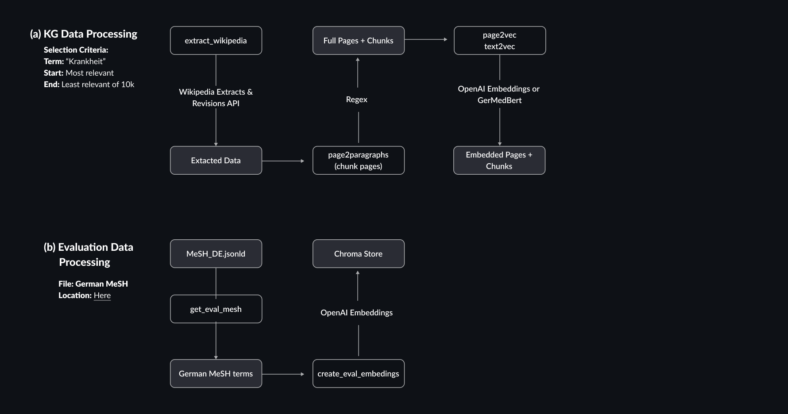
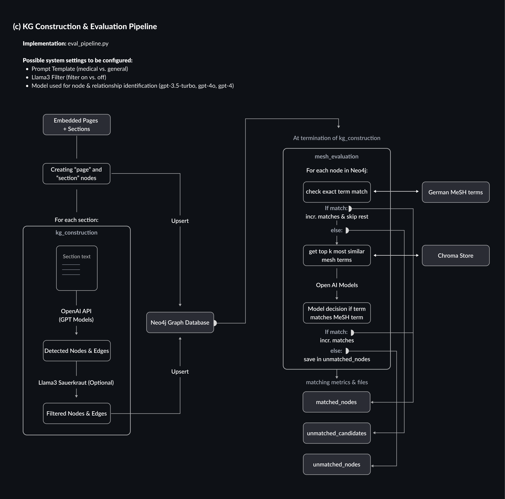
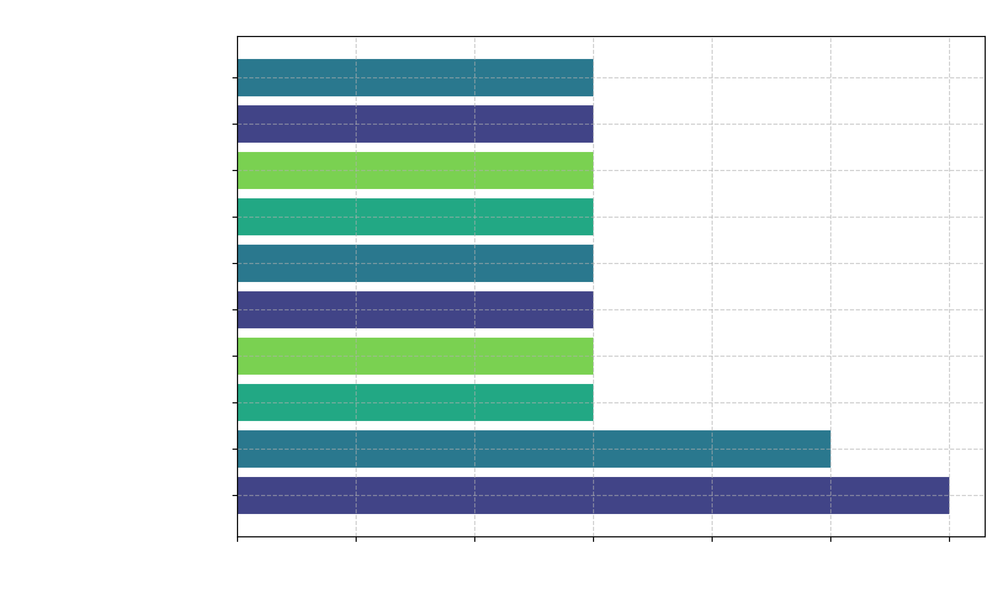

# Automated Generation of a German Medical Knowledge Graph Using Large Language Models

## Introduction
The rapid expansion of published medical research presents a significant challenge for healthcare practitioners and clinicians, who must balance demanding daily tasks with staying updated on the latest scientific advancements in their field [^2] [^3]. Open databases like PubMed help address this issue by collecting, storing, and maintaining an ever-growing body of biomedical knowledge. Although healthcare professionals use PubMed to find up-to-date answers to questions arising in their practice, the sheer volume of over 1 million new publications annually makes extracting relevant information time-consuming [^1]. As a result, many questions that cannot be answered within three minutes are often neglected, potentially disadvantaging the affected patients [^4]. This is partly due to the fact that recent knowledge of complex concepts is frequently distributed over several sources of recent research, making the extraction of relevant information and their relationships exceptionally demanding. As a means for centralized aggregation of modular information around entities and their relationships from independent sources, knowledge graphs exhibit the potential to be a crucial pillar for intelligent medical applications to assist healthcare professionals in their day-to-day tasks. This is due to their inherent capability as an information-dense database as well as a foundation for retrieval-augmented question-answering for knowledge-intensive tasks [^5][^6][^7]. While constructing knowledge graphs at scale is a challenging task encompassing highly specialized NLP tasks such as entity detection, linking and graph completion, recent advances in LLMs give reason to assess, whether a certain configuration of interacting LLMs can streamline the construction process with minimal human interference besides quality control after construction [^8]. While the first strides towards such automatic graph construction pipelines in the medical field have been made, no implementation has yet focused on the German language. 
In light of this background, the aim of this project was to examine the possibility of automatically constructing a medical knowledge graph from unstructured German text. For this purpose, a pipeline was constructed applying a combination of GPT-3.5-Turbo and Llama3 Sauerkraut models [^9]. Furthermore, in hindsight of possible application scenarios in retrieval-augmented generation, this project uncovers the possibility of creating a graph-structured vector store, combining the relational information from a knowledge graph with the embedding space and fast information retrieval capabilities of a vector database.

The remainder of this report is structured as follows. We begin with providing a brief overview of previously published work related to the project and highlight our main contributions. Next, we provide a detailed explanation of our methodologies, starting with a general overview and then delving into the logic behind each significant component of the developed pipelines step-by-step. This technical section is followed by a description of the datasets used for information retrieval and evaluation. The fourth section discusses our approach to evaluating and identifying the best possible system with the developed components and analyzes its performance on the described datasets. In the final section, we address the limitations of our proposed system and explore possibilities for future work in both research and open-source software contribution.
 

## Related Work 

## Objectives
The objectives of this project were twofold. Foremost, the objective was one of exploration. We aimed to explore and report on:
  a) the feasibility of implementing a pipeline via langchain for constructing a specialized medical knowledge graph from unstructured German documents
  b) a possible evaluation strategy for specialized knowledge graphs in the medical domain 
  c) provided that a) was successful, different approaches for extending and improving the pipeline

As will be discussed in the evaluation of our pipeline our main contributions to previous work consist in succeeding in (a) and (b). The small scale of our evaluation, however, does not suffice for clear statements regarding (c). Nevertheless, our results indicate certain trends and give rise to new hypotheses for future work as will be discussed in the last section of this report.

## Methods
In this section, we explain the high-level methodologies employed in this project. Technical details about implementation specifics follow in the subsequent section. 
### Data
#### Wikipedia Documents
For assessing the possibility of constructing a knowledge graph 10.000 Wikipedia pages related to the German word "Krankheit" (="sickness") were extracted. The Wikipedia database identifies each page with a unique page_id, while several versions of the same page might contain different revisions and extensions of Wikipedia contributors over time. For this project, only pages with a unique page_id were retained, resulting in a total dataset of 8.100 pages with a unique page_id. Of these 8.100 pages, all entries were complete except for 10 pages, where no summary of the page was provided. 
For each page, we extracted its full content in "wikitext" format, its title, its page_id, its Wikipedia category tags, its summary description and its outgoing links. As the following procedures are based on the summary, title and content of a page, we focus on these categories in this short dataset description. The following table contains the word count of the extracted page summaries. 

| Wordcount Statistic "Summary" Section | Value      |
|-----------|------------|
| pages used for calculation     | 8090.00 |
| mean      | 72.27  |
| std       | 73.75  |
| min       | 5.00   |
| 25%       | 25.00  |
| 50%       | 43.00  |
| 75%       | 92.00  |
| max       | 718.00 |

As can be seen, the Wikipedia summaries of the pages with a summary are rather short, consisting of 72 words on average. This holds for most pages, as 75% of the summaries contain 92 or less words. As expected for medical texts, the corresponding length is rather high, with 562 characters on average. 

| WordCount Statistic "Full Content" | Value      |
|-----------|------------|
| pages used for calculation     | 8100.00    |
| mean      | 783.78    |
| std       | 1351.20   |
| min       | 26.00     |
| 25%       | 255.00    |
| 50%       | 400.00    |
| 75%       | 744.25    |
| max       | 26051.00  |

The full content of the extracted pages is substantially longer than the summaries. For the 8100 pages, the average word count was 784. While the majority of the data has a wordcount smaller than 744, there exist outliers such as a page with 26.000 words. Thus, chunking text into meaningful sections is going to be a crucial part of data preprocessing. As discussed in the methods section of this report, the semi-parsed wikitext format can be used for this purpose. Special care is taken to avoid cutting off informational dependencies between paragraphs and to maintain the quality of graph construction downstream in the pipeline, especially as the majority of pages only exhibit moderate length.

#### The German Bilingual MeSH
The German Bilingual Medical Subject Headings database (short: MeSH) is a biomedical thesaurus storing English medical terms with their translated German version in a tree-like dependency structure. Originally developed by the U.S. National Library of Medicine, the German MeSH is hosted and maintained by the ZB MED- the German pendant to the U.S. National Library of Medicine - since 2020. The translations and all went through a very careful quality assurance funnel ranging from term identification, term extraction, automatic translation with DeepL to translation curation and translation improvement through subject matter experts [^11]. The German MeSH is downloadable in several formats. For this project, the JsonLD format was chosen.
The corresponding file contained 96.745 unique terms consisting of 165.868 words. Some of these terms include undetected duplicates since certain terms are written using varying sentence structures such as "Husten, trockener" and "trockener Husten". However, during evaluation, this only increases the likelihood of matching correctly detected nodes in the graph construction procedure such that these semantic duplicates were not removed. 

### Pipeline Overview
The following section lists details on implementing an automated system to generate a knowledge graph from unstructured, extracted German Wikipedia Pages. Thereby, the pipeline can be categorized into three stages. 1) the data extraction & preprocessing stage 2) the knowledge graph construction stage and 3) the evaluation stage. Although in the provided repository each stage can be executed on its own, for creating the graphs reported here, a successive execution was necessary in the above order. 
#### Data Preprocessing
The data extraction and preprocessing stage can again be split into two subtasks. One subtask involves several steps to extract and prepare the raw Wikipedia data for embedding and subsequent knowledge graph construction. The other subtask involves preparing the Medical Subject Headings file for later evaluation. 

**Wikipedia Data Preprocessing:**
In total, we extracted 10,000 German Wikipedia pages based on the keyword „Krankheit“ (=„Sickness“). The extraction uses the Wikipedia Extracts API, storing semi-parsed wikitext with headers and subheaders denoted by "==" and "===" respectively. To facilitate a seamless extraction procedure of the full 10.000 pages the Wikipedia Python package was overloaded to allow for a batch-wise iterative extraction procedure overwriting the „SROF“ identifier, which indicates the index of documents until which the last pages were retrieved. Extracting more than 10.000 pages related to the term „Krankheit“ was not possible even with this overloaded strategy, as the Wikipedia API imposes a hard limit on the amount of pages being retrievable for the same keyword. 
As discussed earlier, the length of the pages as well as the complexity of the task give reason to limit the context size of each knowledge graph construction call as much as possible without cutting off important context in each chunk. For this purpose, we employed a conservative chunking strategy that consisted of splitting a page based on its section headers indicated with structural identifiers based on the Wikitext standard. The resulting chunked pages consisted of 34074 sections in total. During chunking the data 7463 paragraphs were empty and skipped. The average chunk/section of this procedure contains 201 tokens when tokenized with the spacy nlp tokenizer based on "de_core_news_sm". For reference, a full page on average has 848 tokens. Thus, the chunking strategy splits each page on average into four sections. To keep the information on the order of the sections in the original text, a unique section_id was generated indicating with an integer in front of the page id, if it was the first (0), or i-th section (i-1) as can be seen in the following example:

| page_title | page_id | section_title                          | section_id |
|------------|---------|----------------------------------------|------------|
| Krankheit  | 2615    | Wortherkunft                           | 0-2615     |
| Krankheit  | 2615    | Definition                             | 1-2615     |
| Krankheit  | 2615    | Geschichtliche und kulturelle Aspekte  | 2-2615     |

After chunking the extracted documents, both the pages as well as the sections are embedded. For embedding the documents two possible models were implemented: `GerMedBERT/medbert-512` and `text-embedding-3-large`. In the final version of the preprocessing pipeline only `text-embedding-3-large` are used. For embedding the total pages, only the pages' summary as well as the page title is used. In the 10 cases in which the summary is missing, the page embedding is based solely on the page title. For embedding the sections, the section title as well as the section content is used. Since empty sections were skipped, each generated embedding is guaranteed to be based on the content discussed in this section. 

It has to be mentioned, that for constructing a knowledge graph this step is fully optional. However, as Neo4j offers an easy construction of a Graph Vector store from a graph database, enabling the usage of Knowledge Graphs as a highly enriched vector store, embedding both the pages and the sections seemed to be a reasonable preprocessing step to include in order to make the graph "ready to use" for retrieval-augmented or similar text generation pipelines. 

**Evaluation Data Preprocessing:**
The German Medical Subject Headings dataset is downloadable in different file formats on the homepage of ZB MED. As the file contains both German and English terms in a nested restructure, preprocessing involves filtering out German terms by scanning through the tree and storing the terms in a set for keyword comparison in the later evaluation stage. Furthermore, we embedded each of the extracted terms with the procedure above using again `text-embedding-3-large` to enable a thoughtful evaluation based on semantic similarity. 

The following illustration provides an overview of the previously mentioned preprocessing steps with respect to the files and structure of this repository. 

#### Knowledge Graph Construction Pipeline
**Graph Construction:**
Constructing and evaluating the knowledge graphs happens in two stages. In the first stage, the graph is constructed. This consists of a mixture of manual node and relationship creations as well as automatic node and relationship extraction from the preprocessed Wikipedia documents.  
In the first step, we use Cypher queries to create a node for each page and a node for each section. Each section node thereby contains its section_id, its full content as well as its embedding. Each page node on the other hand contains its page_id, its title, its summary and its embedding. 
Furthermore, we create a connection from each page to each section indicating their relationship. Also, we create a relationship between all succeeding sections as well as a pointer from each page to its first section. Lastly, we create a node for each category that appeared in the extracted documents and connect it to the pages where it was mentioned. The resulting graph forms the skeleton of the knowledge graph construction. 

Afterwards, we iterate over each of the preprocessed sections and provide it as textual context together with an instructional prompt to a GraphTransformer instance, which is a Langchain wrapper implemented by Neo4j around a BaseModel class with an implementation of the 'with_structure_output()' function. As the model needs to take raw text as input and return highly structured, parseable text as output the group of models that can perform the automatic extraction of nodes and relationships is highly limited. While assessing several quantized open-source possibilities, we eventually settled on using OpenAI models as being the only reasonable option given the timeframe for this project. We anticipate, however, that other opportunities for opensource-based implementation strategies exist and will discuss possible approaches at the end of this report. 

One iteration in the basic knowledge graph construction implementation in this project consists of passing a section to the GraphTransformer instance which returns a list of Nodes and Relationships which can then be upserted into Neo4j. We extend this basic pipeline with two optional features. The first feature consists of contextualizing the input prompt used in the base implementation to the medical domain. The other feature is more advanced. It employs a 5-bit quantized version of Llama3 Sauerkraut running on llama.cpp to filter out irrelevant nodes. I.e. we scan over all automatically extracted nodes of the GraphTransformer and show it to the Llama3 model, which then decides whether the extracted node has relevance for a medical knowledge graph or not. All nodes deemed irrelevant by the model are filtered out. The rest will be uploaded to the graph and connected to the node of the section out of which they were extracted. In this manner, we aimed to balance the trade-off between relevance and exhaustiveness of the information extracted and uploaded into the graph. 

**Graph Evaluation:**
After the graph construction is completed, the evaluation procedure is initiated. Initially, we conduct a Cypher query to extract all automatically created nodes in a list. Afterwards, we scan over each of these nodes. In one pass we perform the following steps. 
First, we assess whether there is an exact term match in the German MeSH file prepared in the preprocessing stage. If there is, the node is added to matched_nodes and we increment the number of matches by one. If not, a second matching gate is entered. In this second gate, we embed the name of the node using `text-embedding-3-large` and retrieve the 4 most similar terms in the MeSH file based on cosine similarity. Given the node name embedding \(Q\) and the MeSH term embedding  \(D\) it is computed as[^12]:
$$\text{Cosine Similarity}(Q, D) = \frac{Q \cdot D}{\|Q\| \cdot \|D\|}$$
Where $Q \cdot D$ is the dot product of the query and document vectors, and $\|Q\|$ and $\|D\|$ are the Euclidean norms of the respective vectors. These terms together with the node name are then posed to GPT-3.5-turbo to decide whether the node name is synonymous or highly similar, i.e. a generalization or specification of the same concept. If so, then the node is added to matched_nodes and the number of matches is incremented by one. If not, the node is marked as unmatched. 

It has to be remarked that the second quality gate was implemented only, because the first quality gate is insufficient to create reliable metrics for evaluation. Otherwise nodes like 'Diabetes Type 2' would not have been matched even though a MeSH term 'Diabetes Type II' existed. Further, we remark that the choice of GPT-3.5-turbo instead of our Llama3 Sauerkraut implementation was motivated by several test cases during development. Contrary to GPT-3.5-Turbo, the quantized Llama3 model exhibited strong hallucination and seemed to be overwhelmed with the prompt input length that included several zero-shot examples to illustrate cases of synonymity, generalizations and specifications. 
Besides outputting the final amount of matches as determined with the above pipeline, we also document the nodes that would have been filtered out because they did not match the exact terminology used in the German MeSH file. Those are saved in a third file besides `matched_nodes` and `unmatched_nodes` in the file `unmatched_candidates`. 

The following illustration outlines the previously described construction and evaluation steps graphically. 

## Evaluation
The following section describes the approach to evaluating and comparing different pipeline configurations. 
### Evaluation Set-up
We evaluated two different pipeline configurations on 5 random pages out of the retrieved 10k Wikipedia pages. The small scale of these evaluations was due to the cost created by OpenAI API calls which would have otherwise exceeded the resources typically available a Software Practical. Regardless of this limitation, we reflect on the different generated graphs from different quantitative and qualitative angles, in order to improve our local and global understanding of the inner workings and challenges during the graph-construction-pipelines. These multiple viewpoints per graph consist of: 
- General graph metrics including the number of nodes, edges and metrics of centrality
- The density of medically relevant information within the graph, measured by the percentage of nodes matched within the German MeSH database
- Different stages of connectivity, evaluated qualitatively by assessing shortest paths

The following pipeline configurations were evaluated. 

| Configuration | Pipeline A | Pipeline B                          | 
|------------|---------|----------------------------------------|
| Prompt  | Prompt tailored for medical text    | Standard prompt provided by Neo4j and translated to German                           |
| Node_Filter  | Llama3 Sauerkraut    | No filter |
| Model  | GPT-3.5-Turbo    | GPT-3.5-Turbo  | 

## Evaluation Dataset
The five randomly selected Wikipedia pages that make up the evaluation set covered the following topics: 
- "Milzbrand" (engl: Anthrax)
- "Lindan" (engl: Lindane)
- "Lissenzephalie" (engl: Lissencephaly)
- "Ryanodin-Rezeptoren" (engl: Ryanodine receptors)
- "Dermatitis" (engl: Dermatitis)

The pages were relatively long, containing 32 sections in total, with the average section consisting of 357.75 tokens.  Specifically, it has to be remarked that all pages contain highly specialized medical information not only indicated by their titles but also by the 10 most frequent n-grams within the text (To the non-German reader: please excuse the missing English translation within the plot). 

On the one hand, bigrams such as "bacillus anthracis," "penicillin G," "doxycycline penicillin," and "ciprofloxacin doxycycline", indicate information out of clinical microbiology, pharmacology, and antibiotic treatments. On the other hand, the inclusion of "Milzbrand" represents information about infectious diseases, while the bigrams "lissencephaly mutations" indicate that the lissencephaly page includes information related to genealogy. Additionally, it can be observed that the diversity in the formulations within the medical text is quite high. Since the most frequent 2-gram (bacillus anthracis) only appears six times. Consequently, we assume that the texts used for evaluation are able to serve as a sufficient representation for general medical literature. 

### Hypothesis
Trivially, 

*H1:* Executing both pipelines runs stably without any issues. 

During the developing of the pipelines, it was observed that the amount of automatically detected nodes substantially varies with the kind of prompt used as an input together with the paragraph whose information is to be extracted and structured into a graph format. Langchain's default as provided by Neo4j contains a lengthy text, framing the model to use general node types but poses otherwise no restrictions. The GraphTransformer implementation in Langchain contains the possibility to restrict Entity extraction via prompting to certain Node types. Examples of Node types would be "Person", "Car" or similar abstract objects. Since the medical field is highly diverse and specificity might be important, creating a list of available Node types proved a misleading strategy for restricting the extraction of medically relevant nodes. Two other approaches were available. First, stating the obvious, while not restricting extraction to certain entity types, one could set the stage and frame the model to extract only medically relevant information in an alternative prompt. As a consequence of this framing, we expect that the model including the medical graph construction prompts to return fewer nodes and relationships between those nodes. 
As we refrained from overly specifying the already challenging prompt that described the task of extracting information about entities and their relationships in a structured format, we created a shortened alternative prompt based on the standard prompt from Neo4j mentioning specifically medical examples. To increase the density of medically relevant information in the returned graph without over-specifying the prompt we implemented a "gate-keeping" chain based on Llama3 Sauerkraut as already explained in the previous sections. Combining both measures in Pipeline A, while both are lacking in Pipeline B we make the following 2 hypotheses: 

*H2:* The graph returned by pipeline A (graph A) is going to contain substantially fewer nodes and edges than the graph returned by pipeline B (graph B).

*H3:* The density of medically relevant information in graph A will be substantially larger than the density in graph B. 

As the evaluation dataset consisted of 5 randomly selected pages, their interrelationships are minimal.   

#### General Graph Metrics
### Evaluation Results
| Metric                                        | Graph A (med/filter_on) | Graph B (ger/filter_off) | Graph C (ger/filter_on) |
|-----------------------------------------------|-----------------------|------------------------|-----------------------|
| Avg shortest path (all nodes)                 | 3.39                  | 3.65                   | 3.44                  |
| Avg. shortest path (auto-generated nodes)           | 3.74                  | 5.93                   | 3.23                  |
| Avg. shortest path (section nodes)                 | 2.78                  | 5.02                   | 1.73                  |
| Max shortest path (all nodes)                 | 11.0                  | 12.0                   | 11.0                  |
| Total number of nodes                         | 332                   | 625                    | 319                   |
| Total number of edges                         | 526                   | 1170                   | 498                   |
| Number of edges between auto-generated nodes | 139                   | 472                    | 133                   |
| MesH Precision Model (%)                      | <u>**70.65**<u>                 | 51.4                   | 69.5                  |
| MesH Precision Direct Matches (%)                 | 26.25                 | 27.5                   | 24.79                 |
| Number of nodes matched in MesH by model      | 183                   | <u>**284** <u>                   | 171                   |
| Number of nodes directly matched in MesH by keyword | 68                    | <u>**152**<u>                    | 61                    |

#### Quantitative Evaluation Results
#### Qualitative Evaluation Results

## Discussion
### Limitations
### Future Work 
### Conclusion

# References

[^1]: Landhuis, Esther. "Scientific literature: Information overload." Nature 535.7612 (2016): 457-458.

[^2]: Bougioukas, Konstantinos I., et al. "How to keep up to date with medical information using web‐based resources: A systematised review and narrative synthesis." Health Information & Libraries Journal 37.4 (2020): 254-292.

[^3]: Andrews, James E., et al. "Information-seeking behaviors of practitioners in a primary care practice-based research network (PBRN)." Journal of the Medical Library Association 93.2 (2005): 206.

[^4]: Daei, Azra, et al. "Clinical information seeking behavior of physicians: A systematic review." International journal of medical informatics 139 (2020): 104144.

[^5]: Pan, Shirui, et al. "Unifying large language models and knowledge graphs: A roadmap." IEEE Transactions on Knowledge and Data Engineering (2024).

[^6]: Edge, Darren, et al. "From local to global: A graph rag approach to query-focused summarization." arXiv preprint arXiv:2404.16130 (2024).

[^7]: Hogan, Aidan, et al. "Knowledge graphs." ACM Computing Surveys (Csur) 54.4 (2021): 1-37.

[^8]: Min, Bonan, et al. "Recent advances in natural language processing via large pre-trained language models: A survey." ACM Computing Surveys 56.2 (2023): 1-40.

[^9]: VAGOsolutions. (n.d.). Llama-3-SauerkrautLM-8b-Instruct. Hugging Face. Retrieved June 29, 2024, from https://huggingface.co/VAGOsolutions/Llama-3-SauerkrautLM-8b-Instruct

[^10]: OpenAI. (2023). GPT-3.5 Turbo. Retrieved June 29, 2024, from https://platform.openai.com/docs/models/gpt-3-5

[^11]: "Deutscher MeSH." ZB MED - Informationszentrum Lebenswissenschaften, accessed July 2, 2024, https://www.zbmed.de/open-science/terminologien/deutscher-mesh.

[^12]: Rahutomo, Faisal, Teruaki Kitasuka, and Masayoshi Aritsugi. "Semantic cosine similarity." The 7th international student conference on advanced science and technology ICAST. Vol. 4. No. 1. 2012.
