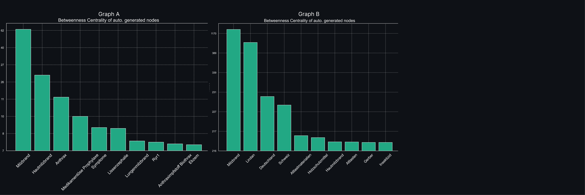
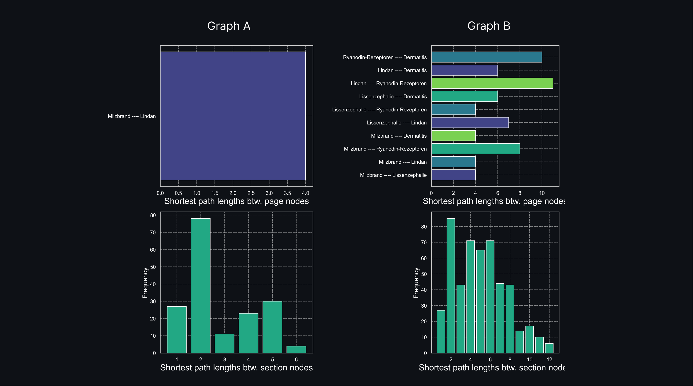
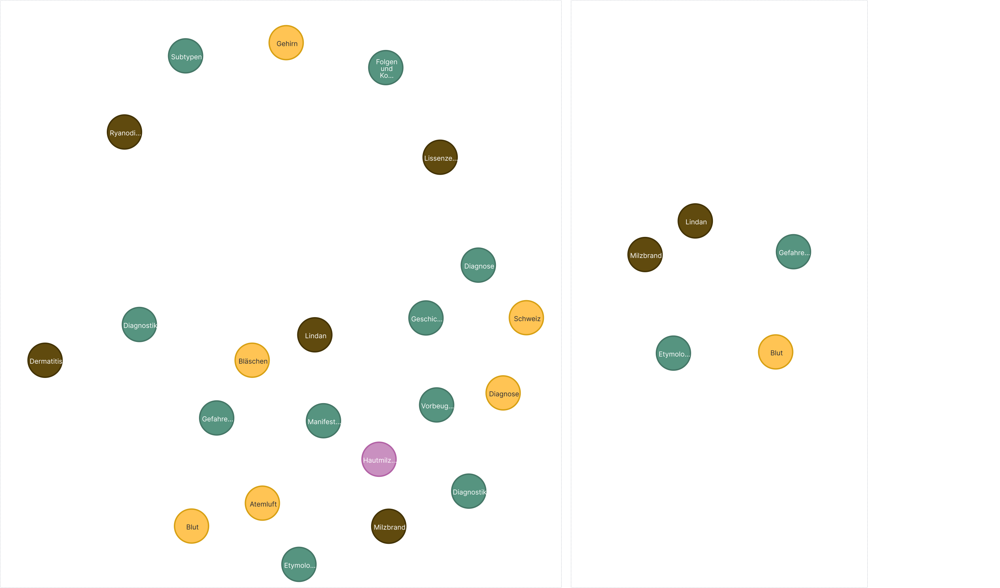

# Automated Generation of a German Medical Knowledge Graph (MKG) Using Large Language Models

## Disclaimer
The figures in this report are only correctly displayed when using Github's **dark mode**. Please excuse the inconvenience. 

## Introduction
Under the guidance of WikiProject Medicine, Wikipedia collects and distributes an ever-growing body of biomedical knowledge. But within the scope of millions of publications in databases such as PubMed, and thousands of articles in Wikipedia finding up-to-date answers to questions, is time-consuming beyond limits [^1]. Thus, to assist clinicians and affected patients in their search for answers to their questions, several question-answering systems based on retrieval-augmented generation have been proposed [^32] [^33]. However, answering questions reliably based on the most recent information remains a challenge that has yet be to overcome as many systems struggle with "connecting the dots" between various documents of importance [^6].
As a means for centralized aggregation of connected information around entities and their relationships from independent sources, knowledge graphs exhibit the potential to be a crucial pillar for intelligent medical applications to face said challenge [^16]. This is due to their inherent capability as an information-dense database as well as a foundation for retrieval-augmented question-answering [^5][^6][^7]. While constructing knowledge graphs at scale is a challenging task encompassing highly specialized NLP methodologies such as entity detection, linking and graph completion, recent advances in LLMs give reason to assess, whether a certain configuration of interacting LLMs can streamline the construction process with minimal human interference [^8]. While the first strides towards such automatic graph construction pipelines in the medical field have been made, no implementation has yet focused on the German language [^30]. 
In light of this background, this project examines the possibility of automatically constructing a Medical Knowledge Graph (MKG) from unstructured German medical Wikipedia articles. For this purpose, a pipeline was constructed by applying a combination of information extracting, document preprocessing and embedding, as well as graph construction and filtering using GPT-3.5-Turbo and Llama3 Sauerkraut [^9]. 

The remainder of this report is structured as follows. We begin by providing a brief overview of previously published work related to the project and highlight our main objectives. This is followed by a description of the datasets used for information retrieval and evaluation. Next, we provide a detailed explanation of our methodologies, starting with a general overview and then delving into the logic behind each significant component of the developed pipelines step-by-step. The fourth section discusses our approach to evaluating and identifying the best possible system with the developed components and analyzes its performance on the described evaluation dataset. In the final section, we address the limitations of our proposed system and explore possibilities for future work.

## Related Work 
A knowledge graph proposes an efficient way of storing and most importantly contextualizing fragmented information into a coherent graph object with nodes as entities and edges as relationships between those entities [^16]. Its value as a graph database for connected information was motivated by industrial applications, pioneered by Google in 2012 [^17] [^16]. Since then further applications have been developed and an increasing body of literature has been published on various aspects such as theoretical definitions, construction procedures and application scenarios in various fields including the biomedical domain [^16][^18][^19][^20]. Ranging from recommender systems, information extraction and question answering, applications look promising [^30][^6]. In retrieval-augmented generation question answering, in particular, knowledge-graph-based systems were shown to overcome the major challenge of correctly answering questions that demanded correct inference over a whole corpus of information [^6]. Given  its high connectivity of knowledge across concepts and documents[^23] this could be of particular interest to medical retrieval-augmented generation, where systems still struggle with the high interconnectivity of medical information and the danger of hallucination [^24][^34]. 
And yet, while research demonstrated the potential of applying knowledge graphs, their construction in the first place remains a severe challenge [^21]. A fact, that is especially true for the task "knowledge fusion" where information from various sources is connected and contextualized into a joined coherent graph. Given the recent rise in Large Language Models (LLMs), different transformer-based architectures were jointly applied at different stages of the construction procedure, from entity extraction to node disambiguation, entity linking and graph fusion and completion with varying success [^25]. 
Besides ensuring high functionality of these different components another factor for successful knowledge graph construction is the relevance of the nodes and  edges with respect to its application scenario. Due to the lack of a ‘one-size fits all’ schema or graph for every setting, in most cases, a graph needs to be constructed for its application domain specifically [^26]. This is also true for the medical domain. Consequently, an increasing amount of research has been conducted on constructing an MKG from various databases. More and more scholars are exploring the ability to automatically construct a knowledge graph for the medical domain with the tools offered by modern Natural Language Processing. In 2020, forinstance, Xu et. al [^27] proposed a pipeline based on BERT for creating a publication-based PubMed knowledge graph with a technological focus on entity extraction and node disambiguation. Murali et. al on the other hand focus on ERH data for their graph construction [^28]. But the exploration has only started. Firstly, creating knowledge graphs for less-resourced languages such as German has to our knowledge not yet been examined. Secondly, recent approaches in the medical domain mostly used encoder-only networks. Surprisingly little research, and to our knowledge none in the medical domain, has been conducted on utilizing decoder-only text generators as a multi-purpose graph construction engine [^31][^30]. Our work aims to fill this gap. Thereby our contributions are the following. Firstly, we propose a pipeline for automatically creating knowledge graphs from medical Wikipedia pages using text-generator models as GraphTransformer engines. Secondly, we do so for the German language. Thirdly, we highlight ways to integrate several LLM chains into each other to improve the quality of the created knowledge graph. 

## Objectives
Our objectives for this project were the following: 
  1. Successful implementation of a pipeline using GPT models for constructing a specialized MKG from unstructured German documents. 
  2. Exemplefying an evaluation strategy that combines the MeSH thesaurus with model-based reasoning for MKGs.
  3. Highlighting different approaches for extending and improving an MKG construction pipeline based on text-generator LLM chains.

## Data
### Wikipedia Documents
For assessing the possibility of constructing a knowledge graph 10.000 Wikipedia pages related to the German word "Krankheit" (="sickness") were extracted. The Wikipedia database identifies each page with a unique page_id, while several versions of the same page might contain different revisions and extensions of Wikipedia contributors over time. For this project, only pages with a unique page_id were retained, resulting in a total dataset of 8.100 pages. Of these 8.100 pages, all entries were complete except for 10 pages, where no summary of the page was provided. 
For each page, we extracted its full content in the so called wikitext format as well as its title, its page_id, its Wikipedia category tags, its summary description and its outgoing links. As the following procedures are based on the summary, title and content of a page, the following description of the dataset focuses on these characteristics. 

| Wordcount Statistic "Summary" Section | Value      |
|-----------|------------|
| pages used for calculation     | 8090.00 |
| mean      | 72.27  |
| std       | 73.75  |
| min       | 5.00   |
| 25%       | 25.00  |
| 50%       | 43.00  |
| 75%       | 92.00  |
| max       | 718.00 |

As can be seen in the table above, the Wikipedia summaries are rather short, consisting of 72 words on average. This holds for most pages, as 75% of the summaries contain 92 or less words. However, as can be expected from medical texts, the length of the words is rather high such that each summary consists of 562 characters on average. 

| WordCount Statistic "Full Content" | Value      |
|-----------|------------|
| pages used for calculation     | 8100.00    |
| mean      | 783.78    |
| std       | 1351.20   |
| min       | 26.00     |
| 25%       | 255.00    |
| 50%       | 400.00    |
| 75%       | 744.25    |
| max       | 26051.00  |

The full content of the extracted pages is substantially longer than the summaries. For the 8100 pages, the average word count was 784. While the majority of the data has a wordcount smaller than 744, there exist outliers such as a page with 26.000 words. Thus, chunking text into meaningful sections is going to be a crucial part of data preprocessing. As discussed in the following section of this report, the semi-parsed wikitext format can be used for this purpose. Special care is taken to avoid cutting off informational dependencies between paragraphs and to maintain the quality of Graph Construction downstream in the pipeline, especially as the majority of pages only exhibit moderate length.

### The German Bilingual MeSH
The German Bilingual Medical Subject Headings database (short: MeSH) is a biomedical thesaurus storing English medical terms with their translated German version in a tree-like dependency structure. Originally developed by the U.S. National Library of Medicine, the German MeSH is hosted and maintained by the ZB MED- the German pendant to the U.S. National Library of Medicine - since 2020 [^11]. The included German words went through a translation funnel with several gates of quality assurance ranging from term identification, term extraction, automatic translation with DeepL to translation curation and translation improvement through subject matter experts [^11]. The German MeSH is downloadable in several formats. For this project, the JsonLD format was chosen.
The corresponding file contained 96.745 unique terms consisting of 165.868 words. Some of these terms include undetected duplicates since certain terms are written using varying sentence structures such as "Husten, trockener" and "trockener Husten". However, during evaluation, this only increases the likelihood of matching correctly detected nodes in the Graph Construction procedure such that these semantic duplicates were not removed. We used the German Bilingual MeSH dataset as a ground truth for determining whether the automatically extracted nodes during Graph Construction are medically relevant. More details on this approach follow in the section discussing the technical implementation of the evaluation pipeline.

### Evaluation Dataset
The evaluation dataset consisted of five randomly selected Wikipedia pages and covered the following topics: 
- "Milzbrand" (Engl: Anthrax)
- "Lindan" (Engl: Lindane)
- "Lissenzephalie" (Engl: Lissencephaly)
- "Ryanodin-Rezeptoren" (Engl: Ryanodine receptors)
- "Dermatitis" (Engl: Dermatitis)

The pages were relatively long, containing 32 sections in total, with the average section consisting of 357.75 tokens.  Specifically, it has to be remarked that all pages contain highly specialized medical information not only indicated by their titles but also by the 10 most frequent bigrams within the text (to the non-German reader: please excuse the missing English translation within the plot. The translations are provided below). 
On the one hand, bigrams such as "bacillus anthracis," "penicillin G," "doxycycline penicillin," and "ciprofloxacin doxycycline", indicate information out of clinical microbiology, pharmacology, and antibiotic treatments. On the other hand, the inclusion of "Milzbrand" represents information about infectious diseases, while the bigrams "lissencephaly mutations" indicate that the lissencephaly page includes information related to genealogy. Additionally, it can be observed that the diversity in the formulations within the medical text is quite high. Since the most frequent 2-gram (bacillus anthracis) only appears six times. Consequently, we assume that the texts used for evaluation are able to serve as a sufficient representation for general medical literature. 

## Methods
The following section lists details on implementing an automated system to generate a knowledge graph from unstructured, extracted German Wikipedia Pages. Thereby, the Pipeline can be categorized into three stages. 1) the data extraction & preprocessing stage 2) the knowledge graph construction stage and 3) the evaluation stage. Although in the provided repository each stage can be executed on its own, for creating the graphs reported here, a successive execution was necessary in the above order. 

### Data Preprocessing
The data extraction and preprocessing stage can again be split into two subtasks. One subtask involves several steps to extract and prepare the raw Wikipedia data for embedding and subsequent knowledge graph construction. The other subtask involves preparing the Medical Subject Headings file for later evaluation. 

#### Wikipedia Data Preprocessing
In total, we extracted 10,000 German Wikipedia pages based on the keyword „Krankheit“ (=„Sickness“). The extraction uses the Wikipedia Extracts API, storing semi-parsed wikitext with headers and subheaders denoted by "==" and "===". To facilitate a seamless extraction procedure of the full 10.000 pages the Wikipedia Python package was overloaded to allow for a batch-wise iterative extraction procedure overwriting the „SROF“ identifier, which indicates the index of documents until which the last pages were retrieved. Extracting more than 10.000 pages related to the term „Krankheit“ was not possible even with this overloaded strategy, as the Wikipedia API imposes a hard limit on the amount of pages being retrievable for the same keyword. 
As discussed earlier, the length of the pages as well as the complexity of the task give reason to limit the context size of each knowledge graph construction call as much as possible without cutting off important context in each chunk. For this purpose, we employed a conservative chunking strategy that consisted of splitting a page based on its section headers indicated with structural identifiers based on the Wikitext standard. The resulting chunked pages consisted of 34074 sections in total. During chunking the data 7463 paragraphs were empty and skipped. The average chunk/section of this procedure contains 201 tokens when tokenized with the spacy nlp tokenizer based on "de_core_news_sm". For reference, a full page on average has 848 tokens. Thus, the chunking strategy splits each page on average into four sections. To keep the information on the order of the sections in the original text, a unique section_id was generated indicating with an integer in front of the page id, if it was the first (0), or i-th section (i-1) as can be seen in the following example:

| page_title | page_id | section_title                          | section_id |
|------------|---------|----------------------------------------|------------|
| Krankheit  | 2615    | Wortherkunft                           | 0-2615     |
| Krankheit  | 2615    | Definition                             | 1-2615     |
| Krankheit  | 2615    | Geschichtliche und kulturelle Aspekte  | 2-2615     |

After chunking the extracted documents, both the pages as well as the sections are embedded. For embedding the documents two possible models were implemented: `GerMedBERT/medbert-512` and `text-embedding-3-large`. In the final version of the preprocessing pipeline only `text-embedding-3-large` embeddings are used. For embedding the total pages, only the pages' summary as well as the page title is used. In the 10 cases in which the summary is missing, the page embedding is based solely on the page title. For embedding the sections, the section title as well as the section content is used. Since empty sections were skipped, each generated embedding is guaranteed to be based on the content discussed in this section. 

It has to be mentioned, that for constructing a knowledge graph this step is fully optional. However, as Neo4j offers an easy construction of a Graph Vector store from a graph database, enabling the usage of Knowledge Graphs as a highly enriched vector store, embedding both the pages and the sections seemed to be a reasonable preprocessing step to include in order to make the graph "ready to use" for retrieval-augmented or similar text generation pipelines once it is constructed. 

#### MeSH Data Preprocessing
The German Medical Subject Headings dataset is downloadable in different file formats on the homepage of ZB MED [^11]. As the file contains both German and English terms in a nested structure, preprocessing involves filtering out German terms by scanning through the tree and storing the terms in a set for keyword comparison in the later evaluation stage. Furthermore, we embedded each of the extracted terms with the procedure above using again `text-embedding-3-large` to enable a later evaluation based on semantic similarity of detected nodes and MeSH terms. 

The following illustration provides an overview of the previously mentioned preprocessing steps with respect to the files and structure of this repository. 

### Knowledge Graph Construction Pipeline
#### Graph Construction
Constructing and evaluating a knowledge graph happens in two stages. In the first stage, the graph is constructed. This consists of a mixture of manual node and relationship creation as well as automatic node and relationship extraction from the preprocessed Wikipedia documents.  
In the first step, we use Cypher queries to create a node for each page and a node for each section. Each section node contains its section_id, its full content and its embedding. Each page node contains its page_id, its title, its summary and its embedding. 
Furthermore, we create a connection from each page to each section indicating their relationship. Also, we create a relationship between all succeeding sections as well as a pointer from each page to its first section. Lastly, we create a node for each category that appeared in the extracted documents and connect it to the pages where it was mentioned. The resulting graph forms the skeleton of the knowledge graph. 

Afterwards, we iterate over each of the preprocessed sections and provide it as textual context together with an instructional prompt to a GraphTransformer instance, which is a Langchain wrapper implemented by Neo4j around a BaseModel class with an implementation of the 'with_structure_output()' function. As the model needs to take raw text as input and return parseable text as output, the group of models that can perform the automatic extraction of nodes and relationships is highly limited. While assessing several quantized open-source possibilities, we eventually settled on using OpenAI models as being the only reasonable option given the timeframe of this project. We anticipate, however, that other opportunities for open-source-based implementation strategies can be developed with a larger scope of resources. Possible approaches for this will be discussed at the end of this report.

To summarize, one iteration in the basic knowledge graph construction implementation consists of passing a section to the GraphTransformer instance which returns a list of nodes and relationships which can then be fed into the skeleton of page, section and category nodes. 

We extend this basic pipeline with two optional features. The first feature consists of contextualizing the input prompt used in the base implementation to the medical domain. The other feature is more advanced. It employs a 5-bit quantized version of Llama3 Sauerkraut running on llama.cpp to filter out irrelevant nodes. I.e. we scan over all automatically extracted nodes of the GraphTransformer and show it to the Llama3 model, which then decides whether the extracted node has relevance for an MKG or not. All nodes deemed irrelevant by the model are filtered out. The rest will be uploaded to the graph and connected to the section from which they were extracted. In this manner, we aimed to balance the trade-off between relevance and exhaustiveness of the information extracted and uploaded into the graph. 

#### Graph Evaluation
After constructing the graph is completed, the evaluation procedure is initiated. Initially, we conduct a Cypher query to extract all automatically created nodes in a list. Afterwards, we scan over each of these nodes. In one pass we perform the following steps. 
First, we assess whether there is an exact keyword match in the German MeSH file prepared in the preprocessing stage. If there is, the node is added to matched_nodes and we increment the number of matches by one. If not, a second matching gate is entered. In this second gate, we embed the name of the node using `text-embedding-3-large` and retrieve the 4 most similar terms in the MeSH file based on cosine similarity. Given the node name embedding \(Q\) and the MeSH term embedding  \(D\) it is computed as[^12]:
$$\text{Cosine Similarity}(Q, D) = \frac{Q \cdot D}{\|Q\| \cdot \|D\|}$$
Where $Q \cdot D$ is the dot product of the query and document vectors, and $\|Q\|$ and $\|D\|$ are the Euclidean norms of the respective vectors. These terms together with the node name are then posed to GPT-3.5-turbo to decide whether the node name is synonymous or highly similar to the provided MeSH term. That is if it is a generalization or specification of the same concept included in the MeSH file. If so, then the node is added to matched_nodes and the number of matches is incremented by one. If not, the node is marked as unmatched. 

It has to be remarked that the second quality gate was implemented only, because the first quality gate is insufficient to create a reliable metric for evaluation. Otherwise nodes like 'Diabetes Type 2' would not have been matched even though a MeSH term 'Diabetes Type II' existed. Further, we remark that the choice of GPT-3.5-turbo instead of our Llama3 Sauerkraut deployment was motivated by several test cases during the engineering process. Contrary to GPT-3.5-Turbo, the quantized Llama3 model exhibited strong hallucination and seemed to be overwhelmed with the prompt input length that included several zero-shot examples to illustrate cases of synonymity, generalization and specification. 
Besides outputting the final amount of matches as determined with the above pipeline, we also document the nodes that would have been filtered out because they did not match the exact terminology used in the German MeSH file. Those are saved in the third file `unmatched_candidates`. 

The following illustration outlines the previously described construction and evaluation steps graphically. 

## Evaluation
We evaluated three different pipeline configurations on 5 random pages out of the retrieved 10k Wikipedia pages. The small scale of this evaluation approach was partly due to the cost accompanied by OpenAI API calls. But more importantly, it was motivated to provide the opportunity for a qualitative analysis of a rather small graph. Therefore, in the following section, we reflect on the different generated graphs from different quantitative and qualitative angles, in order to improve our local and global understanding of the inner workings and challenges during MKG construction. These multiple viewpoints per constructed graph consist of: 
- General graph metrics including the number of nodes, edges and betweenness centrality
- The density of medically relevant information within the graph, measured by the percentage of nodes matched within the German MeSH database
- Different stages of connectivity, evaluated qualitatively by assessing shortest paths

The following pipeline configurations were evaluated. 

| Configuration | Pipeline A | Pipeline B | Pipeline C | 
|------------|---------|-------------------|------------------|
| Prompt  | Prompt tailored for medical text    | Standard prompt provided by Neo4j and translated to German  | Standard prompt provided by Neo4j and translated to German  |
| Node_Filter  | Llama3 Sauerkraut Filter    | No filter | Llama3 Sauerkraut Filter 
| Model  | GPT-3.5-Turbo    | GPT-3.5-Turbo  | GPT-3.5-Turbo  | 

### Hypothesis
In evaluating the pipelines A, B and C across the mentioned metrics we oriented ourselves on the following hypothesis.
Please note that our hypotheses serve the functionality to highlight the technical considerations and assumptions made behind the implementations described earlier. In that sense, they are formulated from an engineering rather than a scientific perspective. 

Trivially, we expect:
- *H1:* All three pipelines execute stably and construct an MKG without issues. 

Secondly, we expect:
- *H2:* The graph returned by Pipeline A (Graph A) is going to contain substantially fewer nodes and edges than the graph returned by Pipeline B (Graph B).
- *H3:* The graph returned by Pipeline C (Graph C) is going to contain fewer nodes and edges than Graph B and Graph A. 

Thereby, we base H2 and H3 on the following reasoning. During the development of the pipelines, it was observed that the amount of automatically detected nodes substantially varies with the kind of prompt used for graph construction. Langchain's default provided by Neo4j contains a lengthy text, framing the model to use general node types but poses otherwise no restrictions (see kg_utils.py). The GraphTransformer implementation in Langchain contains the possibility to restrict entity extraction via prompting to certain node types. Examples of node types would be "Person", "Car" or similar abstract objects. Since the medical field is highly diverse and specificity might be important, creating a list of available node types proved a misleading strategy for restricting the extraction of medically relevant nodes. Two other approaches were available. First, stating the obvious, while not restricting extraction to certain entity types, one could set the stage and frame the model to extract only medically relevant information in an alternative prompt. 

In other words, the medical prompt tries to make the model more selective in the entities and relationships it extracts. As a consequence, we expect the pipeline configuration including the medical prompt to return fewer automatically detected nodes and relationships. 
Likewise, we expect the activation of our Llama3 filter as a second gate-keeping chain to strongly reduce the number of nodes and edges returned by the pipeline. This is expected, as we assume the model to further filter out entities which are deemed to be not relevant to a medical context. 

Consequently, we expect Pipeline A, which includes both restrictions to return fewer nodes and edges than Pipeline B. Pipeline C, on the other hand only contains the node filter without the restrictive medical prompt. Consequently, we again expect it to return less nodes and edges than Pipeline B. However, we expect Pipeline A to return more nodes and edges than Pipeline C, as its prompt is more closely aligned with the criteria that the filter uses to filter out the nodes. In other words, we assume that more of the nodes detected by Pipeline A will be medically relevant such that more nodes will pass the filter. 

Contrary to the number of nodes and edges in the graphs, we anticipate the following relationships in the density of extracted medically relevant information: 
- *H4:* The MeSH precision in Graph A and C will be substantially larger than the precision in Graph B. 
- *H5:* The MeSH precision in Graph A will be substantially larger than the precision in Graph C. 
- *H6:* The absolute number of MeSH-matched nodes will be substantially larger in Graph A than in Graph B.
- *H7:* The absolute number of MeSH-matched nodes will be the same in Graph C and Graph B.

We base H4 on the assumption that the pipeline with the node filter together with (or without) the medical prompt is engineered the most towards returning medical entities. Consequently, we expect a larger percentage of MeSH matches in graphs A and C. 
Furthermore, we assume that Pipeline C without the medical input prompt is going to face a situation where many extracted entities are not medically relevant and therefore filtered out. As we assume that a more general input prompt is less successful in extracting a high number of medically relevant entities, we thus hypothesize the absolute number of entities matched with MeSH terms in Graph C to be smaller than the absolute number of entities in Graph A. Additionally, as we assume our node filter to only filter out medically irrelevant information and as pipelines B and C use the same input prompt, we expect the absolute number of MeSH-matched nodes in graphs B and C to be equal. 

Regarding the detected relationships in the graphs, we expect: 
- *H8:* Among the 10 nodes with the highest betweenness centrality score in graphs A and C all are MeSH-matched.
- *H9:* Among the 10 nodes with the highest betweenness centrality score in Graph B not all are MeSH-matched.

When it comes to the connectivity of the graph, from a scalability perspective the graph should be as sparse as possible [^15], while nevertheless containing the links relevant to its specific domain. Thus, we make the claim that a good pipeline for the medical application scenario should only include connections between documents and concepts via medically relevant nodes. 
This would ensure that if a connection within the graph exists, it is also relevant from a medical point of view. As in Pipeline B, no restrictions are made at all, we expect the resulting graph to not only contain more connections but also that some of those will be irrelevant. As betweenness centrality measures the importance of a node as a connector between other nodes, we expect a good graph customized to the medical context to only contain medically relevant concepts amongst the nodes with the highest score in betweenness centrality [^14]. Therefore, with pipelines A and C containing components that customize them to the medical setting, we make H8. As we expect Graph B to be somewhat noisier and larger with respect to the nodes and edges it includes, we also expect some of its nodes with a high betweenness centrality score to be unrelated to the medical field. 

Furthermore, we hypothesize the following relations between the 5 evaluation pages: 
- *H10:* In graphs A, B and C there exists a path between the page node of Lissencephaly and the page node of Ryanodine receptors. 
- *H11:* In graphs A, B and C there exists a path between the page node of Anthrax and the page node of Dermatitis.

The first hypothesis, H10, is based on the observation that both Lissencephaly and Ryanodine receptors are concepts related to activities in the human brain. The second hypothesis is similarly based on observations made in the text of the related pages as both describe skin-related symptoms. Therefore, we would expect a skin-symptom connection between both pages. From screening the Wikipedia pages, no other relationships were expected. The expectation that each of our pipeline configurations is going to detect these relationships is based on the following reasoning. As we expect Graph A to identify the most nodes and relationships we expect it to identify these relationships amongst other irrelevant ones. On the other hand, as graphs B and C are more restrictive in the nodes and relationships they extract and as we attuned these restrictions to the medical setting, we assume these relationships to be detected as well. 

### Evaluation Results
#### Key Findings
Before outlining the results in detail, we summarize our key findings.
- *Unrejected hypotheses:* H1, H2, H4, H8, H9. 
- *Rejected hypotheses:* H5, H3, H6, H7, H10, H11. 

Further, we identify the following trade-off: increasing the domain-specificity of the graph versus detecting all relevant nodes/links.

Pipeline B was only partly successful in balancing this trade-off. While identifying the most relevant nodes, the percentage of these nodes compared to the overall amount of detected nodes is small. Likewise, it detects the most medically relevant links. But at the same time, it also contains spurious links without medical relevance. Pipeline A achieves a better balance. While it detects fewer nodes and links across pages, it does so by adding less noise to the graph. Pipeline C, performs decently although worse in entity extraction compared to Pipeline A but it is not able to detect any links across pages. Thus, the major challenge resides in detecting domain-specific links across pages without introducing noise in the form of irrelevant edges. This emphasizes the necessity of customizing knowledge graph construction to its specific domain. However, our results also highlight that additional work is needed to finetune our provided domain-restricting components in order to balance or even break the previously mentioned trade-off. This is not entirely unexpected as the task of identifying meaningful relationships across pages is indeed not trivial as each page is partitioned into smaller subsections such that meta-heuristics are needed to detect links across pages. Possible approaches for further fine-tuning will be provided subsequently to the results.  

#### Results
The pipelines were executed without issues, confirming H1. The most important structural differences of the resulting graphs are provided in the following figure.

| Metric                                        | Graph A (med/filter_on) | Graph B (ger/filter_off) | Graph C (ger/filter_on) |
|-----------------------------------------------|-----------------------|------------------------|-----------------------|
| Avg shortest path (all nodes)                 | 3.39                  | 3.65                   | 3.44                  |
| Avg. shortest path (auto-generated nodes)           | 3.74                  | 5.93                   | 3.23                  |
| Avg. shortest path (section nodes)                 | 2.78                  | 5.02                   | 1.73                  |
| Max shortest path (all nodes)                 | 11.0                  | 12.0                   | 11.0                  |
| Total number of nodes                         | 332                   | 625                    | 319                   |
| Total number of edges                         | 526                   | 1170                   | 498                   |
| Number of edges between auto-generated nodes | 139                   | 472                    | 133                   |
| MesH Precision Model (%)                      | ***70.65***                 | 51.4                   | 69.5                  |
| MesH Precision Direct Matches (%)                 | 26.25                 | 27.5                   | 24.79                 |
| Number of nodes matched in MesH by model      | 183                   | ***284***                   | 171                   |
| Number of nodes directly matched in MesH by keyword | 68                    | ***152***                    | 61                    |
| Construction time in seconds | 756.6 | 508 | 608|

In terms of runtime, Pipeline B finished the construction in the shortest period of time with 508 seconds, thus taking approximately 100 seconds per page. This improved runtime is expected as no additional node filtering was conducted. Pipeline C scored second in terms of runtime, which was unexpected as we assumed that the German prompt returns a larger number of nodes which theoretically would have to increase the amount of checks made in the node filter stage. Possible explanations for this behaviour might be different pipeline execution times resulting from the increased specificity of the medical input prompt. 

Concerning the size of the constructed graphs notable differences can be observed. Graph B is larger than Graph A by almost a factor of 2, confirming H2. The same holds for the difference in nodes and edges between Graph B and C. The difference between A and C is more subtle. Graph A contains 4 percentage points more nodes and 5 percentage points more edges. While this difference might not suffice for a "substantial" difference as hypothesized in H3 our previous reasoning could explain this tendency.
While in Graph B the number of nodes might be two times higher, the density of medically relevant nodes, measured by the percentage of entities matched in the MeSH dataset, is 19 percentage points smaller than the score yielded by Pipeline A. A similarly large difference of 18 percentage points can be observed in the comparison with Graph C. Thus, the combination of medical prompt and node filter indeed seems to improve the relevance of the constructed graph with respect to its domain, confirming H4. 

H5, however, is not confirmed, as the difference of one percentage point between Graph A and Graph C is very small. It appears that instead of the prompt, as initially assumed, especially the second chain for node filtering might be a more powerful tool for ensuring the domain-specificity of automatically constructed knowledge graphs. 

While our results emphasize the importance of the second filter chain for ensuring domain specificity, they also show it requires further tuning. In absolute numbers, Pipeline B (without the filter) identifies 101 more MeSH-matched entities than Pipeline A. A similar drop can be observed from Graph B to C. In other words, when using the filter, we increase precision, but we reduce recall as indicated by the 100+ nodes that were falsely filtered out in pipelines A and C. Consequently, H6 and H7 have to be rejected. Possible explanations for this behaviour could be the simple input prompt used for the filter chain, which was necessary to ensure stable outputs of the quantized Llama3 Sauerkraut model. Thus, a possible improvement resides in switching choosing a different technological set-up to deploy Lllama3 Sauerkraut without quantization. An additional explanation for the large unexpected difference in absolute number could be that the terms included in the MeSH do not exclusively include medical terms. We find indications for this in the subsequent stage of the evaluation. 

Considering, the connectivity of the graphs we make two observations. First, as hypothesized among the nodes with the highest betweenness centrality in Graph B not all are medically related. In fact, 30% of the nodes, namely "Altlastenmaterialien", "Holzschutzmittel" and "Gerber" are not matched within the Medical Subject Headings Database. Thus, as a result of lacking restrictions, Pipeline B creates spurious relationships between concepts that might be linguistically but not medically relevant. Pipelines A and C, which included at least one form of domain-specific restriction, did not exhibit these problems as all their nodes with high scores in betweenness centrality are clearly medically related. This confirms our hypotheses H8 and H9. 

It has to be remarked that two other central and clearly medically unrelated nodes  of Graph B, namely "Deutschland" and "Schweiz", are included in the Medical Subject Headings thesaurus. This is unexpected and to at least some degree weakens its suitability as a ground truth graph of medically relevant concepts. We will reflect more on this observation in the section on our project's limitations.

Next, we assess H10 and H11 as well as the connectivity between pages in general. Several paths between all pages (forward and backward) exist in Graph B. Unexpectedly no path exists in Graph C (which is why it is not included in the figure). In Graph A, only one path exists, which is not one of the paths we expected. Consequently, H10 and H11 need to be rejected. Especially intriguing is the existence of a link in Graph A but the absence of a link in Graph C. Together with the previously discussed MeSH precision, this highlights the importance of aligning the input prompt and node filter chain to the same domain-specific extraction purpose in order to increase the likelihood of detecting relevant nodes and edges. Similarly notable is the large difference in Graphs B and A regarding the number of links between pages. To assess whether the accurately detected links between "Lissencephaly - Ryanodine Receptors" and "Anthrax - Dermatitis" in Graph B indeed match our expected relationships between the pages, we assess the shortest paths visually in the following figure. 

Indeed the detected links in Graph B demonstrate the expected relationship. Namely a connection between Lissencephaly and Ryanodine Receptors via the node "brain" and a connection between Anthrax and Dermatitis, via the skin symptom "blisters". Although including the prompt and node filter restriction to the medical case, Pipeline A is not able to identify these relationships. Graph B, however, also contains several links one could classify as "medically irrelevant" or "spurious" such as, for instance, the connection between Anthrax and Lindan via the node "Schweiz" (engl.: Swiss). 
Besides the already discussed links, both graphs also include a link we did not anticipate. A link between "Lindan" and "Anthrax" via the node "blood". While blood is indeed a medical node, we nevertheless consider the detected relationship to be only a weak one given the context in which the term blood appears. In the case of Anthrax, the corresponding page mentions black blood colour to indicate an anthrax-diseased milt. In the case of Lindan, the page mentions that a certain blood level poses a severe danger to humans due the possibility to affect inner organs as well as blood formation. In other words, we classify the relationship as weak because a certain characteristic of blood can be used for characterizing both concepts while no imminently important relationship between both pages exists. 
Taking these detected links together, Pipeline A detected 1 of 3 possible links. Pipeline B detected all 3 links but at the cost of additional noise in the form of spurious links. 

## Conclusion
This project successfully demonstrates the possibility of creating a pipeline for the automated construction of a high-quality medical knowledge graph (MKG) in the German language. Our results, in particular, emphasize the necessity of carefully attuning each component of the pipeline to the medical domain. This specifically includes the incorporation of several nested LLM chains in order to facilitate enhanced control during the graph construction procedure. Furthermore, we demonstrate a model-based quantitative and qualitative evaluation strategy that can be extended to other comparable MGK construction tasks.
The insights gained from this study might be re
 
### Limitations and Future Work
First of all, this project exhibits a limitation in the degree to which alternative approaches to constructing the same pipeline are compared. While, on the one hand, cluster-based approaches with open-source models were tested, the resources available to this project only allowed for locally deploying a quantized open-source model as a GraphTransformer. Together with the lack of the OpenAI-functions-stack, which is used in the background of LangChains GraphTransformer class, implementing the pipeline fully on open-source components would have required not only more computational resources to deploy unquantized models but also more research to assess how structural output limitations can be set within the opensource setting. While this went beyond the scope of this project, it poses an interesting opportunity for future work as the restriction to openAI-API-based functionality severely limits the scalability of the pipeline to a larger corpus of text. 
As of now, this also poses the most severe technical limitation of the proposed Pipeline as its usage requires an OpenAI API key and sufficient funds to construct the graph from the provided corpus of text. 

Furthermore, an API independent implementation based on a compute cluster with possible parallelization could drastically reduce the execution time per page. The importance of such an opportunity can not be understated, as the execution time of 100 pages still restricts to create a corpus large enough for the application cases usually considered in RAG question-answering

The above limitations also impacted the evaluation of the pipeline. Starting with the obvious, the amount of pages processed to evaluate the different pipeline configurations is very small and cannot reflect the pipeline's actual application setting. Also, besides its small scale, the quantitative part of the evaluation mostly focuses on node MeSH matches and overall graph structure. While this sheds light on the amount and relevance of the nodes being automatically detected.  While we suggested an approach to qualitatively assess this possibility using a screening procedure of shortest paths between documents, this is not able to quantitatively justify a claim about our pipeline's ability to create and detect meaningful connections across various documents within a *large* corpus. However, exactly this capability might be of particular interest especially when using the generated knowledge graph as a graph-vector store for retrieval-augmented generation. Yet, we lacked the medical knowledge to extend our evaluation dataset with additional documents and ground truth links to create a dataset large enough for assessing graph connectivity at scale. Such endeavours, however, open up an opportunity for future interdisciplinary work between medical professionals and computer scientists. 

There are two settings we anticipate for this purpose. In an ideal setting, the medical professionals create a sophisticated ground truth dataset with encoded high-level relationships (i.e. page "heart" is connected to page "heart stroke"). Subsequently, after executing the pipeline to construct the graph, the existence of shortest paths between related pages can be assessed and evaluated by the medical professionals. 
In a minimal setting, without available medical experts, one could create an evaluation dataset by following hyperlinks within the HTML code of the Wikipedia pages. The decision of whether a link between two pages is medically relevant or not could be made by a large language model. After constructing the dataset of evaluation pages using the previously described process, the graphs can be generated using our pipeline. During the evaluation phase, the presence of shortest paths between linked pages can be analyzed. In an advanced methodology, the binary evaluation of the "existence/non-existence" of these paths can be enhanced by parsing the nodes and edges along the shortest path into textual form. This textual representation can then be assessed again by another language model to determine if the expected link is accurately reflected by the shortest path. 

# Acknowledgements
I want to express my gratitude towards Prof. Gertz for empowering me with the necessary resources to implement this project and for his availability to mentor me throughout all stages of implementation. Also, I want to thank Marina Walter for the very helpful and uplifting discussions.

# References

[^1]: Landhuis, Esther. "Scientific literature: Information overload." Nature 535.7612 (2016): 457-458.

[^2]: Bougioukas, Konstantinos I., et al. "How to keep up to date with medical information using web‐based resources: A systematised review and narrative synthesis." Health Information & Libraries Journal 37.4 (2020): 254-292.

[^3]: Andrews, James E., et al. "Information-seeking behaviors of practitioners in a primary care practice-based research network (PBRN)." Journal of the Medical Library Association 93.2 (2005): 206.

[^4]: Daei, Azra, et al. "Clinical information seeking behavior of physicians: A systematic review." International journal of medical informatics 139 (2020): 104144.

[^5]: Pan, Shirui, et al. "Unifying large language models and knowledge graphs: A roadmap." IEEE Transactions on Knowledge and Data Engineering (2024).

[^6]: Edge, Darren, et al. "From local to global: A graph rag approach to query-focused summarization." arXiv preprint arXiv:2404.16130 (2024).

[^7]: Hogan, Aidan, et al. "Knowledge graphs." ACM Computing Surveys (Csur) 54.4 (2021): 1-37.

[^8]: Min, Bonan, et al. "Recent advances in natural language processing via large pre-trained language models: A survey." ACM Computing Surveys 56.2 (2023): 1-40.

[^9]: VAGOsolutions. (n.d.). Llama-3-SauerkrautLM-8b-Instruct. Hugging Face. Retrieved June 29, 2024, from https://huggingface.co/VAGOsolutions/Llama-3-SauerkrautLM-8b-Instruct

[^10]: OpenAI. (2023). GPT-3.5 Turbo. Retrieved June 29, 2024, from https://platform.openai.com/docs/models/gpt-3-5

[^11]: "Deutscher MeSH." ZB MED - Informationszentrum Lebenswissenschaften, accessed July 2, 2024, https://www.zbmed.de/open-science/terminologien/deutscher-mesh.

[^12]: Rahutomo, Faisal, Teruaki Kitasuka, and Masayoshi Aritsugi. "Semantic cosine similarity." The 7th international student conference on advanced science and technology ICAST. Vol. 4. No. 1. 2012.

[^13]: Feng, Yichun, et al. "Knowledge Graph-based Thought: a knowledge graph enhanced LLMs framework for pan-cancer question answering." bioRxiv (2024): 2024-04.

[^14]: Brandes, Ulrik. "A faster algorithm for betweenness centrality." Journal of mathematical sociology 25.2 (2001): 163-177.

[^15]: Geisberger, Robert, et al. "Contraction hierarchies: Faster and simpler hierarchical routing in road networks." Experimental Algorithms: 7th International Workshop, WEA 2008 Provincetown, MA, USA, May 30-June 1, 2008 Proceedings 7. Springer Berlin Heidelberg, 2008.

[^16]: Hogan, Aidan, et al. "Knowledge graphs." ACM Computing Surveys (Csur) 54.4 (2021): 1-37.

[^17]: A. Singhal 2012. Introducing the Knowledge Graph: Things, not strings. Google Blog. Accessed July 12, 2024 https://www.
blog.google/products/search/introducing-knowledge-graph-things-not/.

[^18]: Fensel, Dieter, et al. "Introduction: what is a knowledge graph?." Knowledge graphs: Methodology, tools and selected use cases (2020): 1-10.

[^19]: Hao, Xuejie, et al. "Construction and application of a knowledge graph." Remote Sensing 13.13 (2021): 2511.

[^20]: Wang, Chengbin, et al. "Information extraction and knowledge graph construction from geoscience literature." Computers & geosciences 112 (2018): 112-120.

[^21]: Peng, Ciyuan, et al. "Knowledge graphs: Opportunities and challenges." Artificial Intelligence Review 56.11 (2023): 13071-13102.

[^22]: Mohamed, Sameh K., Aayah Nounu, and Vít Nováček. "Biological applications of knowledge graph embedding models." Briefings in bioinformatics 22.2 (2021): 1679-1693.

[^23]: Fierz, Walter. "Structured content and connectivity of medical information-the Medical Data Web." Knowledge media in healthcare: opportunities and challenges. IGI Global, 2002. 205-233.

[^24]: Xiong, Guangzhi, et al. "Benchmarking retrieval-augmented generation for medicine." arXiv preprint arXiv:2402.13178 (2024).

[^25]: Pan, Shirui, et al. "Unifying large language models and knowledge graphs: A roadmap." IEEE Transactions on Knowledge and Data Engineering (2024).

[^26]: Abu-Salih, Bilal. "Domain-specific knowledge graphs: A survey." Journal of Network and Computer Applications 185 (2021): 103076.

[^27]: Xu, Jian, et al. "Building a PubMed knowledge graph." Scientific data 7.1 (2020): 205.

[^28]: Murali, Lino, et al. "Towards electronic health record-based MKG construction, completion, and applications: A literature study." Journal of biomedical informatics 143 (2023): 104403.

[^29]: Chandak, Payal, Kexin Huang, and Marinka Zitnik. "Building a knowledge graph to enable precision medicine." Scientific Data 10.1 (2023): 67.

[^30]: Wu, Xuehong, et al. "MKG: Data sources, construction, reasoning, and applications." Big Data Mining and Analytics 6.2 (2023): 201-217.

[^31]: Melnyk, Igor, Pierre Dognin, and Payel Das. "Grapher: Multi-stage knowledge graph construction using pretrained language models." NeurIPS 2021 Workshop on Deep Generative Models and Downstream Applications. 2021.

[^32]: Thirunavukarasu, Arun James, et al. "Large language models in medicine." Nature medicine 29.8 (2023): 1930-1940.

[^33]: Lozano, Alejandro, et al. "Clinfo. ai: An Open-Source Retrieval-Augmented Large Language Model System for Answering Medical Questions using Scientific Literature." PACIFIC SYMPOSIUM ON BIOCOMPUTING 2024. 2023. 

[^34]: Fierz, Walter. "Structured content and connectivity of medical information-the Medical Data Web." Knowledge media in healthcare: opportunities and challenges. IGI Global, 2002. 205-233.

