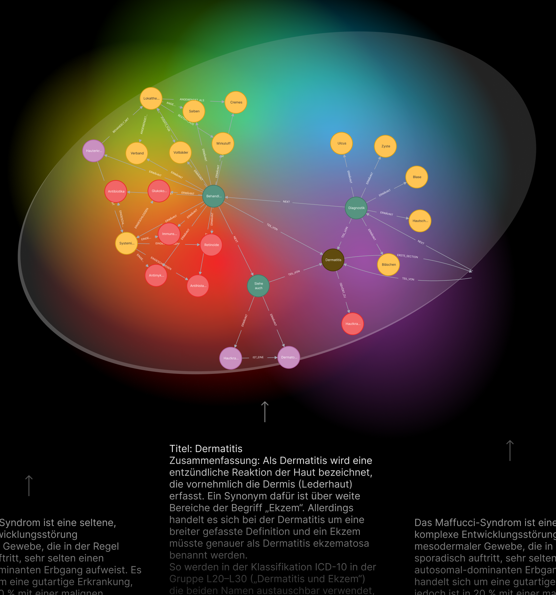

# WikiMedGraph
Automatic knowledge graph construction based on German Wikipedia pages. 

-------------




## Overview
This project utilizes a combination of Langchain, ChromaDB, Neo4j and llama.cpp together with the OpenAI API as well as the Wikipedia API to create a pipeline for automated knowledge-graph construction based on Wikipedia articles. The project is structured into modular scripts that each perform a key component of the overall pipeline. These include: 
1. Data extraction from Wikipedia
2. Data Preprocessing to prepare the raw text for knowledge graph construction
3. Knowledge Graph Construction
4. Pipeline Evaluation

The output of each node in the pipeline is stored in the data folders ranging from 00_raw, storing the extracted raw Wikipedia pages, over several stages of preprocessing to 04_eval, storing the evaluation results and 05_graphs which stores the constructed knowledge graphs exported out of Neo4J into a JSON file each. 

## Technologies Used

- **Langchain:** Langchain is a framework for developing applications poI red by language models, including information retrievers, text generation pipelines and other wrappers to facilitate a seamless integration of LLM-related open-source software. Within the project, Langchain was implemented to build several LLM-chains both with OpenAI models as I ll as llama.cpp integrations. 

- **ChromaDB:** Chroma DB is an open-source vector storage system designed for efficiently storing and retrieving vector embeddings. In the project, ChromaDB was used to store embeddings of the German Mesh vocabulary to facilitate a careful evaluation of the pipeline's performance. 

- **llama.cpp:** llama.cpp implements Meta's LLaMa architecture in efficient C/C++ to enable a fast local runtime. Usage of llama.cpp is facilitated by a langchain wrapper, making it possible to run quantized versions of llama-based architectures on a local GPU. 

- **OpenAI API:** The OpenAI API provides access to OpenAIs language models, enabling integration of highly performant LLM capabilities into programmatic applications. Within the scope of the project the OpenAI API was used for two purposes: 1) To generate embeddings for the extracted Wikipedia text. 2) To automatically extract knowledge-graph data out of Wikipedia sections based on Neo4j's GraphTransformer implementation in langchain_community. 

- **Llama3 Sauerkraut:** Llama3 Sauerkraut is an advanced implementation of the LLaMa3 architecture, fine-tuned and specialized for the German language. Llama3 Sauerkraut was used in the project within a second LLM pipeline, which takes the automatically detected graph data from the OpenAI model as input and filters out the nodes relevant to the provided context. 

- **Neo4j:** Neo4j Graph Database: Neo4j is a highly scalable, native graph database. In the project, Neo4j was used as the database to store and grow the generated detected relational data in a knowledge graph. For this purpose, a local Neo4j with apoc plugin as I ll as read and write file access was initialized.

- **Wikipedia API:** The data extracted for this project, consisted of German Wikipedia pages related to the term "sickness" which I obtained via the Wikipedia API. The basis of extraction was based on the Wikipedia python package, which was overloaded and extended in certain functionalities key for extracting the data at scale.

## Installation and Set-up

1. **Prerequisites:**
   - Ensure you have Python installed on your system. Your Python version should match 3.10.
   - Ensure to have conda installed on your system.
   - Create a folder where you want to store the project.

2. **Create a Conda Environment:**
   - Create a conda environment
   - Activate the environment
   ```bash
   conda create --name your_project_env python=3.10
   conda activate your_project_env
   ```

4. **Clone the Repository into your working directory:**
   ```bash
   https://github.com/KennyLoRI/knowledgeGraph.git
   ```
   When using Mac set pgk_config path:
   ```bash
   export PKG_CONFIG_PATH="/opt/homebrew/opt/openblas/lib/pkgconfig"
   ```

   then switch to the working directory of the project:
   ```bash
   cd your_project_env
   ```
   
6. **Install Dependencies:**
   ```bash
   pip install -r requirements.txt
   ```
   
7. **Llama.cpp GPU installation:**
   (When using CPU only, skip this step.)

   This part might be slightly tricky, depending on which system the installation is done. I  do NOT recommend installation on Windows. I myself ran the code only on MacOS. However, a Linux installation is available as well.

   **Linux:**
   ```bash
   CMAKE_ARGS="-DLLAMA_CUBLAS=on" FORCE_CMAKE=1 pip install --upgrade --force-reinstall llama-cpp-python --no-cache-dir
   ```

   **MacOS:**
   ```bash
   CMAKE_ARGS="-DLLAMA_METAL=on" FORCE_CMAKE=1 pip install --upgrade --force-reinstall llama-cpp-python --no-cache-dir
   ```

   If anything goes wrong in this step, please refer to the installation guide provided [here](https://python.langchain.com/docs/integrations/llms/llamacpp) and also [here](https://llama-cpp-python.readthedocs.io/en/latest/install/macos/).

9. **Neo4j Setup:**
   - Download Neo4j [here](https://neo4j.com/download/) and follow the installation guide [here](https://neo4j.com/docs/operations-manual/current/installation/osx/). Remark: My implementation was configured with OpenJDK 17.
   - Open Neo4j on your local machine and set up the Apoc and GDS plugin by clicking through the UI `dbms>plugin>apoc>install` and `dbms>plugin>gds>install`.
   - Open the directory in your NEO4J HOME where the neo4j.config is located and create an 'apoc.config file'. In this file include
     ```bash
      apoc.import.file.use_neo4j_config=false
     ```
   Note: this configuration allows Neo4j to read any file on your system, but for importing the Knowledge Graph from a JSON file on your machine this is necessary. For other ways of importing knowledge graph data please refer to the advanced Apoc documentation of Neo4j [here](https://neo4j.com/labs/apoc/4.2/overview/apoc.import/).

10. **Data & Model Setup:**
      - Download the [model file](https://huggingface.co/VAGOsolutions/Llama-3-SauerkrautLM-8b-Instruct). Insert the model file at `models/Llama-3-SauerkrautLM-8b-Instruct-Q5_K_M.gguf`.
      - For a minimal test setup go to [this](https://drive.google.com/drive/folders/1-8hVX75ui3wtk-4OPQckqe8EdvQtv-1H?usp=sharing) Google Drive link and download the data folder (folder called `data`). Insert the data folder in the `data` directory.
      - Set up an OpenAI Account [here](https://openai.com/index/openai-api/).

11. **API Setup:**
   Place your API keys and your Neo4j database credentials in `config/keys.env` in the following format: 
     ```bash
     NEO4J_URL=bolt://localhost:SOME_NUMBER
     NEO4J_USERNAME=
     NEO4J_PASSWORD=
     OPENAI_API_KEY=
      ```
## Usage: 
Before following the subsequent steps make sure the upper configurations are met. 

### Reproducing the knowledge graph construction and evaluation of the report: 
To reproduce the evaluation results: 
- move to the evaluation directory,
- make sure you are in the working environment in which you installed the required packages
- open the Neo4j Desktop application and click on "Start" of the DMBS System whose URL you have stored in the keys.env file.
- For evaluating the pipeline with Llama3 Sauerkraut as a node filter and with the medical prompt, go to the eval_pipeline.py file and set:

```bash
models = ['gpt-3.5-turbo']
node_filter_strategies = [True]
prompt_strategies = ['german_med_prompt']
```
- For evaluating the pipeline without the Llama3 Sauerkraut node filter and with the standard German prompt, go to the eval_pipeline.py file and set:
```bash
models = ['gpt-3.5-turbo']
node_filter_strategies = [False]
prompt_strategies = ['german_prompt']
  
```

- Then execute:
```bash
   python eval_pipeline.py
```

- The evaluation results and the constructed graphs will be located in the `04_eval`and `05_graphs` directory. Graphs are stored as JSON files and can be imported into Neo4J again using the import function that we created as part of the KnowledgeGraph class. Usage is exemplified in the file `test_import.py` in the graph_generation package. Note that the import is only possible if the extended apoc configuration explained above is correctly implemented. 

### Advanced usage: 
If you are interested in constructing larger knowledge graphs based on the extracted 10k Wikipedia pages follow this procedure

1. **Run preprocessing:** 
   - Go to `page2paragraphs.py` and change the input path in line 15 from `../data/00_raw/eval_pages_raw.csv` to `../data/00_raw/pages_until_sroff_9750.csv`.
   - To not overwrite the preprocessed evaluation pages, change the output file locations from  `../data/02_preprocessed/eval_pages_chunked.csv` and `../data/02_preprocessed/eval_pages_total.csv` to `../data/02_preprocessed/big_pages_chunked.csv` and  `../data/02_preprocessed/big_pages_total.csv`
   - Then execute `page2paragraphs.py`

2. **Run Embedding:**
   - Go to `page2vec.py` and change the input path in line 27 to `../data/02_preprocessed/big_pages_total.csv` to fit the change made above.
   - Do the same in `text2vec.py` with `../data/02_preprocessed/big_pages_chunked.csv`.
   - As above, define  new output paths in each file to not overwrite the preprocessed evaluation data. Use for example the paths `../data/03_model_input/big_embedded_pages.csv` in the page2vec.py file and `../data/03_model_input/big_embedded_chunks.csv` in the text2vec.py file. 
   - Executing both `text2vec.py` and `page2vec.py` will now embed each page based on the page's title + summary and each section based on the section's content using OpenAI Embeddings. The results are stored in the location you have defined earlier, i.e. `../data/03_model_input/big_embedded_pages.csv` and `../data/03_model_input/big_embedded_chunks.csv`.

3. **Run Knowledge Graph Construction:**
   - Go to the parameters.yml file and configure the settings you want to use for executing the pipeline. For the best possible outcome set:
   ```bash
   llm: gpt-3.5-turbo #model used for extracting graph information
   llm_framework: openai #currently only openAI supported
   llama2: /Users/Kenneth/PycharmProjects/knowledgeGraph/models/llama-2-7b-chat.Q5_K_M.gguf
   llama3: /Users/Kenneth/PycharmProjects/knowledgeGraph/models/Llama-3-SauerkrautLM-8b-Instruct-Q5_K_M.gguf
   modelling_location: local #Legacy: only needed for cluster script
   prompt: german_med_prompt #Prompt used for extracting graph information
   until_chunk: THE NUMBER OF SECTIONS YOU WANT TO PROCESS 
   kg_construction_section_path: 
   ../data/03_model_input/big_embedded_chunks.csv
   kg_construction_page_path: ../data/03_model_input/big_embedded_pages.csv
   filter_node_strategy: True # whether Llama3 Sauerkraut is used for filtering nodes for medical context
   ```
   - Warning: If you indeed intend to run the pipeline on all 10k documents you need to set until_chunk to the total number of sections in big_embedded_chunks.csv. Per default until chunk is set to 33 as a safeguarding mechanism. 
   - navigate to the src directory and execute
   ``bash
   python test_kg_construction.py
   ``

## Pipeline Details:
The Pipeline is segmented into several interdependent scripts. Each high-level functionality is grouped in a Python package. Helper functions are stored separately within the utils folder. Each set of helper functions is again grouped by its application such as evaluation `eval_utils.py`, embedding `èmbed_utils.py`, knowledge graph construction `kg_utils.py` and preprocessing `preprocess_utils.py`.

- **`config`:**
  Contains API keys as well as pipeline settings in the parameters.yml files. Whenever the source code mentions `config['value']`, this refers to the settings in the parameters.yml file. This allows to centrally modify the setting for a pipeline execution. The only exception is during the construction of the knowledge graph construction in the evaluation script. Here the configurations depend on the settings manually assigned in `models`, `prompt_strategies` and `node_filter_strategies` of the eval_pipeline.py file. 
- **'data_extraction':**
  Contains the extract_wikipedia.py file which implements the search_wiki script for requesting Wikipedia data at scale. In the search_params dictionary, one can specify the number of pages to retrieve for a given keyword. At most 10k pages can be extracted in total. Note that at the time of creating the code, the implementation in the Wikipedia package allowed the extraction of German articles in semi-parsed wikitext. This means that headers and subheaders are marked by "==" and "===" within the text. Later preprocessing builds up on this structure. This is only enabled via the Extracts API of Wikipedia. At the moment, hoI ver, this output structure is not supported any more for German Texts and is only available for articles retrieved from the English Wikipedia URL. More details can be found [here](https://www.mediawiki.org/wiki/Extension:TextExtracts). The retrieved data will be stored in the `data/00_raw/` directory under the `pages_until_sroff_{search_params['sroffset']}` directory where search_params['sroffset'] specifies the total amount of retrieved data. 
- **`data_preprocessing`:**
  This package groups several preprocessing scripts which again can be grouped into two groups. The first group of preprocessing scripts are related to preprocessing the retrieved Wikipedia pages. `page2paragraphs.py` chunks the pages and `text2vec.py` embeds the chunks as I ll as the pages. `get_eval_mesh.py` takes the German-English MeSH JSON file and extracts the German terms. The resulting mesh data is stored under `data/04_eval/mesh_de_total.txt`. The `create_eval_embeddings.py` script embeds all German MesH terms in `mesh_de_total.txt` and stores them in the Chroma store at `data/04_eval/chroma_store`.
- **`graph_generation`:**
  Contains all scripts around constructing and storing the knowledge graph. `kg_construction.py` contains the function to create the knowledge graph. In order for this function to successfully create the knowledge graph the local Neo4j server has to be running the corresponding DBMS specified in the keys.env file. To achieve this open the Neo4j Desktop application and start the DMBS. The `testexport.py` file demonstrates how an existing knowledge graph can be exported from Neo4j as I ll as imported. The underlying code to facilitate a seamless export and import is part of the overloaded KnowledgeGraph written for this purpose. The Python package also contains a second folder with legacy code that was developed along the way of several experiments. Besides facilitating transparency it also includes pointers towards implementing the pipeline in a parallelized share-memory setting and on a cluster. 
- **`evaluation`:**
  The evaluation package contains three scripts. The central script is `eval_pipeline.py` which runs a grid search over specified hyperparameter combinations. It executes the kg_construciton script as I ll as the script in `mesh_evaluation.py`. `mesh_evaluation.py` loads the nodes and relationship of the knowledge graph constructed in kg_construction and evaluates them with respect to the German MesH terms. The last script `èval_data_creation.py` is only included for transparency and showcases the random selection of the evaluation pages based on the retrieved data set of 10k Wikipedia documents. 
- **`utils`:**
  Stores helper functions separately. Each set of helper functions is again grouped by its application such as evaluation `eval_utils.py`, embedding `èmbed_utils.py`, knowledge graph construction `kg_utils.py` and preprocessing `preprocess_utils.py`.


## Reproduction & Cost Estimation
To use the methodologies implemented in the pipeline the user may rerun the scripts in the order discussed above. For running kg_construction without evaluation, the user may write a script only running the kg_construction functions. For reproducing the kg_construction and evaluation results documented in the practical report, the user may execute the eval_pipeline.py script. 
WARNING: Depending on the model used for knowledge graph construction the costs may vary significantly. I  highly recommend executing the pipeline with GPT-3.5-Turbo. To estimate the costs for kg_construction (without embedding) only, the token_analysis.py file in the `analysis` directory can be executed and modified to the new API rates specified [here](https://openai.com/api/pricing/). Note that the estimation is optimistic and that I do not claim the estimation to be accurate. Providing a fully accurate estimation is challenging since the larger fraction of the costs depends on the amount of outputted tokens per API call, which cannot be determined apriori.

## Acknowledgements
I want to specifically express my gratitude towards Prof. Gertz for empowering me with the necessary resources to implement this project and for his availability to mentor me throughout all stages of implementation.  Also, I want to thank Marina Walter for very thoughtful and uplifting discussions. 

## Disclaimer
I  confirm that I  did this project on my own and only with the tools and means mentioned in the technical report submitted with this repository.


